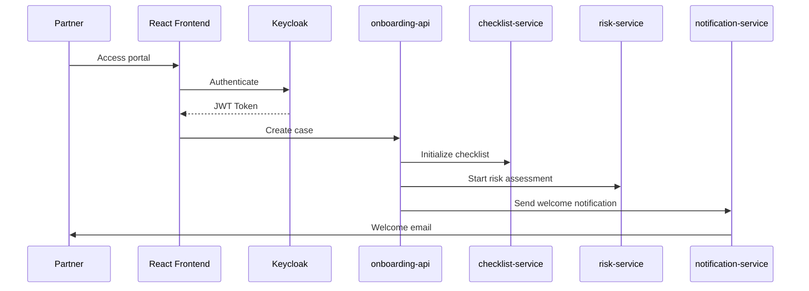
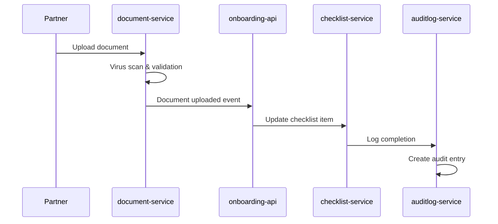
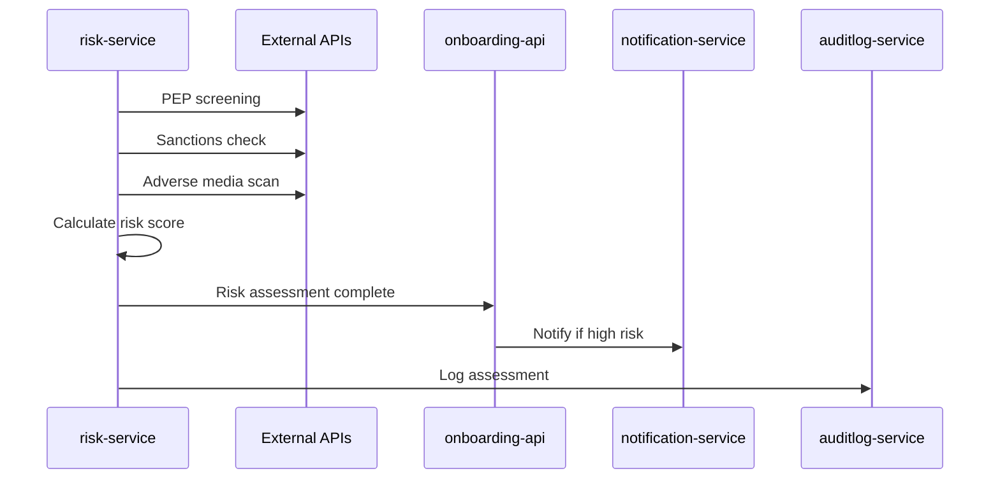

# 🏗️ Complete KYC/Onboarding Platform System Overview

## 🎯 **System Purpose**
Enterprise-grade **Know Your Customer (KYC)** and **Know Your Business (KYB)** onboarding platform for financial institutions, fintechs, and regulated businesses to comply with AML/CFT regulations while providing seamless customer experiences.

## 🏛️ **High-Level Architecture**

```mermaid
graph TB
    subgraph "Frontend Layer"
        UI[React Frontend<br/>Partner Portal]
        ADMIN[Admin Dashboard<br/>Internal Users]
    end
    
    subgraph "API Gateway & Load Balancing"
        NGINX[NGINX Ingress<br/>TLS Termination]
        LB[Load Balancer<br/>Traffic Distribution]
    end
    
    subgraph "Authentication & Authorization"
        KC[Keycloak<br/>OAuth 2.1 / OIDC]
        AD[Active Directory<br/>LDAP Federation]
    end
    
    subgraph "Microservices Layer"
        OA[onboarding-api<br/>Core Business Logic]
        CS[checklist-service<br/>KYC/KYB Workflows]
        RS[risk-service<br/>AML & Risk Scoring]
        AS[auditlog-service<br/>Compliance Logging]
        PA[projections-api<br/>Read Models & Analytics]
        NS[notification-service<br/>Email/SMS/Push]
        DS[document-service<br/>File Management]
        WD[webhook-dispatcher<br/>Partner Integration]
    end
    
    subgraph "Data Layer"
        PG[(PostgreSQL Cluster<br/>Primary Database)]
        REDIS[(Redis<br/>Caching & Sessions)]
        MINIO[(MinIO<br/>Object Storage)]
    end
    
    subgraph "Event Streaming"
        KAFKA[Apache Kafka<br/>Event Bus]
    end
    
    subgraph "Observability Stack"
        PROM[Prometheus<br/>Metrics Collection]
        GRAF[Grafana<br/>Dashboards]
        ELK[Elasticsearch<br/>Log Aggregation]
        JAEGER[Jaeger<br/>Distributed Tracing]
    end
    
    subgraph "Infrastructure"
        K8S[Kubernetes (K3s)<br/>Container Orchestration]
        HELM[Helm Charts<br/>Deployment Automation]
    end
    
    UI --> NGINX
    ADMIN --> NGINX
    NGINX --> LB
    LB --> KC
    LB --> OA
    LB --> CS
    LB --> RS
    LB --> AS
    LB --> PA
    LB --> NS
    LB --> DS
    LB --> WD
    
    KC --> AD
    
    OA --> PG
    CS --> PG
    RS --> PG
    AS --> PG
    PA --> PG
    NS --> PG
    DS --> PG
    
    OA --> REDIS
    PA --> REDIS
    
    DS --> MINIO
    
    OA --> KAFKA
    CS --> KAFKA
    RS --> KAFKA
    AS --> KAFKA
    NS --> KAFKA
    WD --> KAFKA
    
    OA --> PROM
    CS --> PROM
    RS --> PROM
    AS --> PROM
    PA --> PROM
    NS --> PROM
    DS --> PROM
    WD --> PROM
    
    PROM --> GRAF
    OA --> ELK
    CS --> ELK
    RS --> ELK
    AS --> ELK
    PA --> ELK
    NS --> ELK
    DS --> ELK
    WD --> ELK
```

## 🔧 **Core Components Breakdown**

### **🎨 Frontend Layer**

#### **React Partner Portal**
- **Purpose**: External partner/customer interface
- **Features**: 
  - Case creation and management
  - Document upload with drag-and-drop
  - Real-time progress tracking
  - Risk assessment visualization
  - Notification center
- **Technology**: React 18, TypeScript, Keycloak JS, Axios
- **Authentication**: OAuth 2.1 via Keycloak

#### **Admin Dashboard**
- **Purpose**: Internal staff interface (compliance officers, case managers)
- **Features**:
  - Complete case oversight
  - Risk assessment tools
  - Audit trail viewing
  - Bulk operations
  - Analytics and reporting
- **Users**: Internal employees via Active Directory federation

### **🔐 Authentication & Authorization**

#### **Keycloak (Identity Provider)**
- **Dual Authentication System**:
  - **External Users**: Partners, customers (direct registration)
  - **Internal Users**: Employees via Active Directory LDAP federation
- **Features**:
  - OAuth 2.1 / OpenID Connect
  - Multi-factor authentication
  - Single Sign-On (SSO)
  - Role-based access control (RBAC)
  - Session management
- **Realms**: 
  - `partners` - Main realm for all users
  - LDAP federation for internal users

#### **Active Directory Integration**
- **LDAP Federation**: Seamless integration with corporate AD
- **Group Mapping**: AD groups → Keycloak roles
- **Attributes Sync**: User details synchronized automatically

### **🏗️ Microservices Architecture**

#### **1. onboarding-api (Core Service)**
- **Purpose**: Main business logic and orchestration
- **Responsibilities**:
  - Case lifecycle management
  - Applicant data management
  - Business rule enforcement
  - Integration orchestration
- **Database**: `onboarding` (PostgreSQL)
- **Key Entities**: OnboardingCase, Applicant, Address
- **API Endpoints**: 
  - `POST /cases` - Create new case
  - `GET /cases/{id}` - Get case details
  - `PUT /cases/{id}/status` - Update case status

#### **2. checklist-service (Workflow Engine)**
- **Purpose**: Dynamic KYC/KYB checklist management
- **Responsibilities**:
  - Checklist template management
  - Progress tracking
  - Completion validation
  - Workflow automation
- **Database**: `checklist_service` (PostgreSQL)
- **Key Features**:
  - Type-specific checklists (Individual, Corporate, Trust, Partnership)
  - Required vs optional items
  - Completion percentage calculation
  - Business rule validation

#### **3. risk-service (AML & Compliance)**
- **Purpose**: Risk assessment and AML screening
- **Responsibilities**:
  - Risk factor analysis
  - Weighted scoring algorithms
  - AML screening integration
  - Risk level determination
- **Database**: `risk_service` (PostgreSQL)
- **Risk Factors**:
  - PEP (Politically Exposed Persons)
  - Sanctions screening
  - Adverse media
  - Geographic risk
  - Industry risk
- **Scoring**: 0-100 scale with configurable weights

#### **4. auditlog-service (Compliance Logging)**
- **Purpose**: Immutable audit trail for regulatory compliance
- **Responsibilities**:
  - Comprehensive event logging
  - Tamper-proof records
  - Compliance reporting
  - Data integrity verification
- **Database**: `auditlog_service` (PostgreSQL)
- **Key Features**:
  - SHA-256 integrity hashing
  - PII masking for security
  - Searchable audit history
  - Compliance categorization (KYC, AML, GDPR)

#### **5. projections-api (Read Models)**
- **Purpose**: Optimized read models for frontend consumption
- **Responsibilities**:
  - Denormalized data views
  - Dashboard analytics
  - Reporting and exports
  - Performance optimization
- **Database**: `projections_api` (PostgreSQL)
- **Technology**: EF Core + Dapper for complex queries
- **Key Features**:
  - Real-time dashboard data
  - Paginated case lists
  - Advanced filtering and sorting
  - CSV export functionality

#### **6. notification-service (Communications)**
- **Purpose**: Multi-channel notification delivery
- **Responsibilities**:
  - Email notifications
  - SMS messaging
  - Push notifications
  - Delivery tracking
- **Database**: `notification_service` (PostgreSQL)
- **Channels**: Email, SMS, In-App, Push, Webhook
- **Features**:
  - Template-based messaging
  - Retry logic with exponential backoff
  - Delivery status tracking
  - Scheduled notifications

#### **7. document-service (File Management)**
- **Purpose**: Document upload, storage, and verification
- **Responsibilities**:
  - File upload handling
  - Document classification
  - Verification workflows
  - Secure storage
- **Storage**: MinIO (S3-compatible object storage)
- **Features**:
  - Multi-format support
  - Virus scanning
  - OCR integration ready
  - Version control

#### **8. webhook-dispatcher (Integration)**
- **Purpose**: Secure webhook delivery to partners
- **Responsibilities**:
  - HMAC-signed webhook delivery
  - Retry mechanisms
  - Partner integration
  - Event broadcasting
- **Security**: HMAC-SHA256 signatures
- **Features**:
  - Configurable retry schedules
  - Delivery confirmation
  - Partner-specific endpoints
  - Event filtering

### **🗄️ Data Architecture**

#### **Database Strategy: Database-per-Service**
- **Engine**: PostgreSQL 15+ (ACID compliance, JSON support)
- **Pattern**: Each microservice owns its data
- **Benefits**: Service independence, scaling flexibility, fault isolation

#### **Individual Databases**:
1. **onboarding** - Core business data
2. **checklist_service** - Workflow data
3. **risk_service** - Risk assessments
4. **auditlog_service** - Compliance logs
5. **projections_api** - Read models
6. **notification_service** - Message tracking
7. **document_service** - File metadata
8. **keycloak** - Authentication data

#### **Caching Layer**
- **Redis**: Session storage, frequently accessed data
- **Use Cases**: User sessions, API rate limiting, temporary data

#### **Object Storage**
- **MinIO**: S3-compatible storage for documents
- **Features**: Versioning, encryption, access policies

### **📡 Event-Driven Communication**

#### **Apache Kafka (Event Streaming)**
- **Purpose**: Asynchronous service communication
- **Topics**:
  - `onboarding.domain-events` - Business events
  - `onboarding.integration-events` - System events
  - `notifications.events` - Communication events
  - `audit.events` - Compliance events

#### **Event Flow Examples**:
```
Case Created → Checklist Created → Risk Assessment Started → Notifications Sent
Case Approved → Audit Logged → Partner Notified → Projections Updated
Document Uploaded → Verification Started → Status Updated → Progress Tracked
```

### **🔍 Observability & Monitoring**

#### **Metrics Collection (Prometheus)**
- **Application Metrics**: Request rates, response times, error rates
- **Business Metrics**: Cases processed, approval rates, SLA compliance
- **Infrastructure Metrics**: CPU, memory, disk, network

#### **Visualization (Grafana)**
- **Dashboards**: System health, business KPIs, performance metrics
- **Alerting**: Automated alerts for system issues and SLA breaches

#### **Logging (Elasticsearch + Kibana)**
- **Structured Logging**: JSON format with correlation IDs
- **Centralized**: All services log to Elasticsearch
- **Search & Analysis**: Kibana for log exploration

#### **Distributed Tracing (Jaeger)**
- **Request Tracing**: End-to-end request flow visibility
- **Performance Analysis**: Bottleneck identification
- **Error Tracking**: Failure point identification

### **🚀 Infrastructure & Deployment**

#### **Kubernetes (K3s)**
- **Container Orchestration**: Automated deployment, scaling, management
- **High Availability**: Multi-replica deployments
- **Service Discovery**: Automatic service registration and discovery
- **Load Balancing**: Built-in load balancing and traffic distribution

#### **Helm Charts**
- **Deployment Automation**: Infrastructure as Code
- **Configuration Management**: Environment-specific values
- **Dependency Management**: Service dependencies and ordering

#### **CI/CD Pipeline (GitHub Actions)**
- **Automated Testing**: Unit tests, integration tests, security scans
- **Automated Deployment**: GitOps workflow
- **Quality Gates**: Code quality, security, performance checks

## 🔄 **System Workflows**

### **1. Partner Onboarding Flow**


### **2. Document Verification Flow**


### **3. Risk Assessment Flow**


## 🛡️ **Security Architecture**

### **Authentication & Authorization**
- **OAuth 2.1**: Modern authentication standard
- **JWT Tokens**: Stateless authentication
- **Role-Based Access Control**: Fine-grained permissions
- **Multi-Factor Authentication**: Additional security layer

### **Data Protection**
- **Encryption in Transit**: TLS 1.3 for all communications
- **Encryption at Rest**: Database and file encryption
- **PII Masking**: Sensitive data protection in logs
- **Data Retention**: Configurable retention policies

### **API Security**
- **Rate Limiting**: DDoS protection
- **Input Validation**: SQL injection prevention
- **CORS Configuration**: Cross-origin request control
- **HMAC Signatures**: Webhook integrity verification

### **Compliance Features**
- **Audit Trails**: Immutable compliance logging
- **Data Integrity**: SHA-256 hash verification
- **Access Logging**: Complete user activity tracking
- **Regulatory Reporting**: Automated compliance reports

## 📊 **Performance & Scalability**

### **Horizontal Scaling**
- **Kubernetes HPA**: Automatic pod scaling based on metrics
- **Load Balancing**: Traffic distribution across replicas
- **Database Scaling**: Read replicas for query performance

### **Performance Optimizations**
- **Connection Pooling**: Efficient database connections
- **Caching**: Redis for frequently accessed data
- **CDN Ready**: Static asset optimization
- **Async Processing**: Non-blocking operations

### **Monitoring & Alerting**
- **SLA Monitoring**: Response time and availability tracking
- **Business Metrics**: Case processing times, approval rates
- **Capacity Planning**: Resource utilization trends

## 🎯 **Business Capabilities**

### **Multi-Entity Support**
- **Individual KYC**: Personal customer onboarding
- **Corporate KYB**: Business entity verification
- **Trust Verification**: Trust structure validation
- **Partnership KYB**: Partnership entity onboarding

### **Regulatory Compliance**
- **AML/CFT**: Anti-Money Laundering compliance
- **KYC/KYB**: Know Your Customer/Business procedures
- **GDPR**: Data protection and privacy
- **SOX**: Financial reporting compliance
- **PCI DSS**: Payment card data security

### **Integration Capabilities**
- **REST APIs**: Standard HTTP/JSON interfaces
- **Webhooks**: Real-time event notifications
- **File Imports**: Batch data processing
- **Third-Party APIs**: External service integration

## 🚀 **Deployment & Operations**

### **Environment Management**
- **Development**: Local K3s cluster
- **Staging**: Pre-production testing
- **Production**: High-availability deployment

### **Backup & Recovery**
- **Database Backups**: Automated daily backups
- **Configuration Backups**: Infrastructure as Code
- **Disaster Recovery**: Multi-region deployment ready

### **Maintenance & Updates**
- **Rolling Updates**: Zero-downtime deployments
- **Blue-Green Deployment**: Risk-free updates
- **Database Migrations**: Automated schema updates

## 📈 **Analytics & Reporting**

### **Real-Time Dashboards**
- **Case Processing**: Live case status and metrics
- **Performance KPIs**: SLA compliance and processing times
- **Risk Analytics**: Risk distribution and trends

### **Business Intelligence**
- **Conversion Rates**: Application to approval ratios
- **Processing Efficiency**: Time-to-completion metrics
- **Compliance Metrics**: Audit trail completeness

### **Export Capabilities**
- **CSV Exports**: Data export for analysis
- **API Endpoints**: Programmatic data access
- **Scheduled Reports**: Automated report generation

## 🎊 **System Benefits**

### **For Financial Institutions**
- **Regulatory Compliance**: Automated AML/KYC compliance
- **Risk Management**: Comprehensive risk assessment
- **Operational Efficiency**: Streamlined onboarding processes
- **Audit Readiness**: Complete audit trails

### **For Partners**
- **Seamless Experience**: Intuitive onboarding interface
- **Real-Time Updates**: Live progress tracking
- **Self-Service**: Reduced support requirements
- **Mobile Ready**: Responsive design

### **For Developers**
- **Modern Architecture**: Microservices and cloud-native
- **API-First**: Complete REST API coverage
- **Observability**: Comprehensive monitoring and logging
- **Scalability**: Horizontal scaling capabilities

### **For Operations**
- **Automation**: Minimal manual intervention
- **Monitoring**: Proactive issue detection
- **Scalability**: Automatic resource scaling
- **Reliability**: High availability and fault tolerance

---

## 🎯 **Summary**

This is a **complete, enterprise-grade KYC/Onboarding platform** featuring:

- ✅ **8 Microservices** with Clean Architecture
- ✅ **Dual Authentication** (Keycloak + Active Directory)
- ✅ **Event-Driven Architecture** with Kafka
- ✅ **Complete Observability** stack
- ✅ **Kubernetes-Native** deployment
- ✅ **Regulatory Compliance** ready
- ✅ **React Frontend** integration ready
- ✅ **Production-Grade** security and performance

**Ready for immediate deployment and React frontend integration!** 🚀
