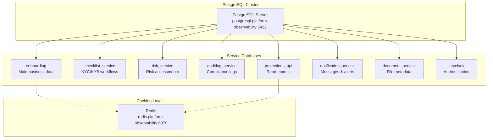
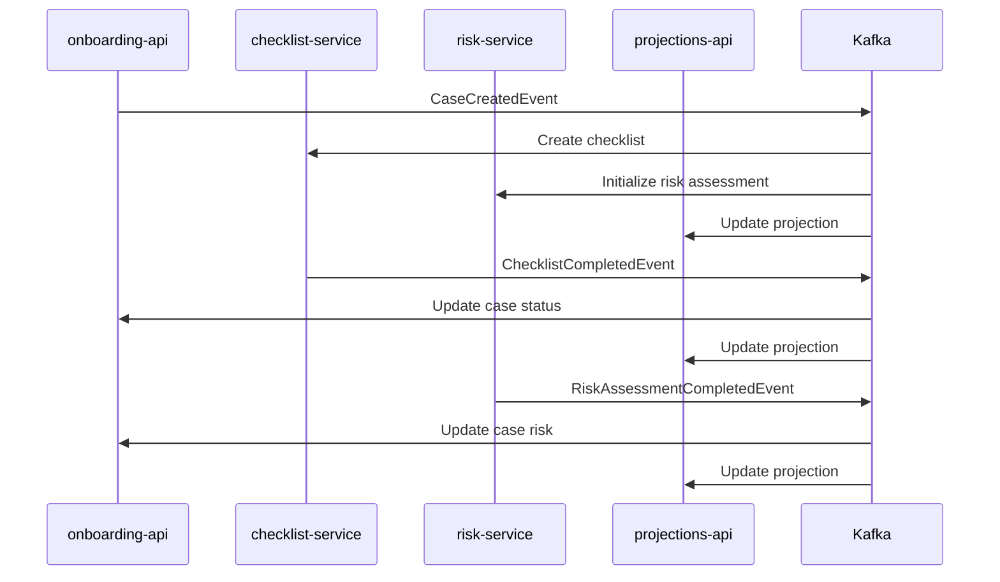

# 🗄️ Database Architecture Guide

## 📊 **Database Overview**

Your KYC/Onboarding platform uses a **microservices database pattern** with **PostgreSQL** as the primary database engine. Each service has its own dedicated database for data isolation and independence.

## 🏗️ **Database Architecture**

### **Database-per-Service Pattern**


## 🗃️ **Individual Database Schemas**

### **1. onboarding (Main Service)**
**Purpose**: Core onboarding cases and applicant data
```sql
-- Main Tables
onboarding_cases
├── id (uuid, primary key)
├── case_id (varchar, unique)
├── type (varchar) -- Individual, Corporate, Trust, Partnership
├── status (varchar) -- Draft, InProgress, PendingReview, Approved, Rejected
├── partner_id (varchar)
├── partner_reference_id (varchar)
├── created_at (timestamp)
├── updated_at (timestamp)
├── submitted_at (timestamp)
├── approved_at (timestamp)
└── rejected_at (timestamp)

applicants
├── id (uuid, primary key)
├── case_id (uuid, foreign key)
├── first_name (varchar)
├── last_name (varchar)
├── date_of_birth (date)
├── email (varchar)
├── phone_number (varchar)
├── nationality (varchar)
└── created_at (timestamp)

addresses
├── id (uuid, primary key)
├── applicant_id (uuid, foreign key)
├── type (varchar) -- Residential, Business, Mailing
├── street (varchar)
├── city (varchar)
├── state (varchar)
├── postal_code (varchar)
├── country (varchar)
└── is_primary (boolean)
```

### **2. checklist_service**
**Purpose**: KYC/KYB checklist workflows and progress tracking
```sql
checklists
├── id (uuid, primary key)
├── case_id (varchar, unique)
├── type (varchar) -- Individual, Corporate, Trust, Partnership
├── status (varchar) -- InProgress, Completed
├── completion_percentage (decimal)
├── required_completion_percentage (decimal)
├── created_at (timestamp)
└── updated_at (timestamp)

checklist_items
├── id (uuid, primary key)
├── checklist_id (uuid, foreign key)
├── name (varchar)
├── description (text)
├── category (varchar) -- Identity, Address, Financial, Compliance, Documentation
├── is_required (boolean)
├── order (integer)
├── status (varchar) -- Pending, Completed, Skipped
├── completed_at (timestamp)
├── completed_by (varchar)
└── notes (text)
```

### **3. risk_service**
**Purpose**: Risk assessments and AML compliance scoring
```sql
risk_assessments
├── id (uuid, primary key)
├── case_id (varchar, unique)
├── overall_risk_level (varchar) -- Low, MediumLow, Medium, MediumHigh, High
├── risk_score (decimal) -- 0-100
├── status (varchar) -- InProgress, Completed, Rejected
├── created_at (timestamp)
├── completed_at (timestamp)
└── updated_at (timestamp)

risk_factors
├── id (uuid, primary key)
├── risk_assessment_id (uuid, foreign key)
├── type (varchar) -- PEP, Sanctions, AdverseMedia, Geography, Industry
├── level (varchar) -- Low, Medium, High
├── score (decimal) -- 0-100
├── description (text)
├── source (varchar)
├── created_at (timestamp)
└── weight (decimal) -- Factor weight in overall calculation
```

### **4. auditlog_service**
**Purpose**: Immutable audit trail for compliance
```sql
audit_log_entries
├── id (uuid, primary key)
├── event_type (varchar)
├── entity_type (varchar)
├── entity_id (varchar)
├── case_id (varchar, nullable)
├── user_id (varchar)
├── user_role (varchar)
├── action (varchar) -- Create, Update, Delete, Approve, Reject
├── description (text)
├── previous_values (jsonb)
├── new_values (jsonb)
├── timestamp (timestamp)
├── ip_address (inet)
├── user_agent (text)
├── session_id (varchar)
├── severity (varchar) -- Low, Medium, High, Critical
├── compliance_category (varchar) -- KYC, AML, DataProtection, Financial
├── integrity_hash (varchar) -- SHA-256 for tamper detection
└── integrity_verified (boolean)
```

### **5. projections_api (Read Models)**
**Purpose**: Denormalized data optimized for React frontend queries
```sql
onboarding_case_projections
├── id (uuid, primary key)
├── case_id (varchar, unique)
├── type (varchar)
├── status (varchar)
├── partner_id (varchar)
├── partner_name (varchar)
├── partner_reference_id (varchar)
-- Applicant Information (denormalized)
├── applicant_first_name (varchar)
├── applicant_last_name (varchar)
├── applicant_email (varchar)
├── applicant_phone (varchar)
├── applicant_date_of_birth (date)
├── applicant_nationality (varchar)
├── applicant_address (varchar)
├── applicant_city (varchar)
├── applicant_country (varchar)
-- Progress Information
├── progress_percentage (decimal)
├── total_steps (integer)
├── completed_steps (integer)
-- Checklist Information (denormalized)
├── checklist_id (uuid)
├── checklist_status (varchar)
├── checklist_completion_percentage (decimal)
├── checklist_total_items (integer)
├── checklist_completed_items (integer)
├── checklist_required_items (integer)
├── checklist_completed_required_items (integer)
-- Risk Assessment Information (denormalized)
├── risk_assessment_id (uuid)
├── risk_level (varchar)
├── risk_score (decimal)
├── risk_status (varchar)
├── risk_factor_count (integer)
-- Document Information
├── document_count (integer)
├── verified_document_count (integer)
├── pending_document_count (integer)
├── rejected_document_count (integer)
-- Timestamps
├── created_at (timestamp)
├── updated_at (timestamp)
├── submitted_at (timestamp)
├── approved_at (timestamp)
├── rejected_at (timestamp)
-- Assignment Information
├── assigned_to (varchar)
├── assigned_to_name (varchar)
├── assigned_at (timestamp)
-- Compliance Information
├── requires_manual_review (boolean)
├── has_compliance_issues (boolean)
└── compliance_notes (text)

-- Indexes for performance
CREATE INDEX idx_case_projections_partner_id ON onboarding_case_projections(partner_id);
CREATE INDEX idx_case_projections_status ON onboarding_case_projections(status);
CREATE INDEX idx_case_projections_risk_level ON onboarding_case_projections(risk_level);
CREATE INDEX idx_case_projections_assigned_to ON onboarding_case_projections(assigned_to);
CREATE INDEX idx_case_projections_created_at ON onboarding_case_projections(created_at);
CREATE INDEX idx_case_projections_updated_at ON onboarding_case_projections(updated_at);
CREATE INDEX idx_case_projections_requires_manual_review ON onboarding_case_projections(requires_manual_review);
-- Composite indexes for common queries
CREATE INDEX idx_case_projections_partner_status_created ON onboarding_case_projections(partner_id, status, created_at);
CREATE INDEX idx_case_projections_status_risk_created ON onboarding_case_projections(status, risk_level, created_at);
CREATE INDEX idx_case_projections_assigned_status_created ON onboarding_case_projections(assigned_to, status, created_at);
```

### **6. notification_service**
**Purpose**: Email/SMS notifications and delivery tracking
```sql
notifications
├── id (uuid, primary key)
├── type (varchar) -- Welcome, StatusUpdate, DocumentRequest, etc.
├── channel (varchar) -- Email, SMS, Push, InApp, Webhook
├── recipient (varchar)
├── subject (varchar)
├── content (text)
├── status (varchar) -- Pending, Scheduled, Sending, Sent, Delivered, Failed, Cancelled
├── priority (varchar) -- Low, Medium, High, Critical
├── case_id (varchar, nullable)
├── partner_id (varchar, nullable)
├── template_id (varchar, nullable)
├── template_data (jsonb)
├── created_at (timestamp)
├── scheduled_at (timestamp, nullable)
├── sent_at (timestamp, nullable)
├── delivered_at (timestamp, nullable)
├── failed_at (timestamp, nullable)
├── error_message (text, nullable)
├── retry_count (integer)
└── max_retries (integer)
```

## 🔧 **Database Configuration**

### **Connection Strings**
Each service connects to its own database:
```bash
# Service-specific databases
onboarding-api:          "Host=postgresql.platform-observability;Database=onboarding;Username=onboarding_user;Password=${POSTGRES_PASSWORD}"
checklist-service:       "Host=postgresql.platform-observability;Database=checklist_service;Username=checklist_user;Password=${POSTGRES_PASSWORD}"
risk-service:            "Host=postgresql.platform-observability;Database=risk_service;Username=risk_user;Password=${POSTGRES_PASSWORD}"
auditlog-service:        "Host=postgresql.platform-observability;Database=auditlog_service;Username=auditlog_user;Password=${POSTGRES_PASSWORD}"
projections-api:         "Host=postgresql.platform-observability;Database=projections_api;Username=projections_user;Password=${POSTGRES_PASSWORD}"
notification-service:    "Host=postgresql.platform-observability;Database=notification_service;Username=notification_user;Password=${POSTGRES_PASSWORD}"
```

### **Entity Framework Core Configuration**
All services use EF Core 8.0 with PostgreSQL provider:
```csharp
// Common configuration across all services
builder.Services.AddDbContext<ServiceDbContext>(options =>
{
    options.UseNpgsql(
        builder.Configuration.GetConnectionString("PostgreSQL"),
        npgsqlOptions =>
        {
            npgsqlOptions.EnableRetryOnFailure(
                maxRetryCount: 5,
                maxRetryDelay: TimeSpan.FromSeconds(10),
                errorCodesToAdd: null);
        });
});
```

### **Database Migrations**
Each service handles its own migrations:
```csharp
// Automatic migration on startup (all services)
using (var scope = app.Services.CreateScope())
{
    var context = scope.ServiceProvider.GetRequiredService<ServiceDbContext>();
    try
    {
        await context.Database.MigrateAsync();
        Log.Information("Database migration completed successfully");
    }
    catch (Exception ex)
    {
        Log.Error(ex, "Database migration failed");
        throw;
    }
}
```

## 🚀 **Performance Optimizations**

### **1. Connection Pooling**
```csharp
// Enabled by default in Npgsql
options.UseNpgsql(connectionString, npgsqlOptions =>
{
    npgsqlOptions.EnableRetryOnFailure(maxRetryCount: 5);
    // Connection pooling is automatic
});
```

### **2. Read Replicas (projections-api)**
The projections-api uses both EF Core and Dapper for optimal performance:
```csharp
// EF Core for simple queries
var cases = await _context.OnboardingCases.ToListAsync();

// Dapper for complex analytical queries
var dashboard = await _connection.QuerySingleAsync<DashboardData>(complexSql);
```

### **3. Caching Layer**
Redis is configured for caching frequently accessed data:
```bash
Redis: "redis.platform-observability:6379"
```

### **4. Database Indexes**
Strategic indexes are created for:
- Primary keys (automatic)
- Foreign keys
- Frequently queried columns (status, partner_id, created_at)
- Composite indexes for complex queries

## 🔒 **Security & Compliance**

### **1. Database Users & Permissions**
Each service has its own database user with minimal required permissions:
```sql
-- Example for checklist-service
CREATE USER checklist_user WITH PASSWORD 'secure_password';
CREATE DATABASE checklist_service OWNER checklist_user;
GRANT CONNECT ON DATABASE checklist_service TO checklist_user;
GRANT USAGE ON SCHEMA public TO checklist_user;
GRANT CREATE ON SCHEMA public TO checklist_user;
```

### **2. Data Encryption**
- **At Rest**: PostgreSQL supports transparent data encryption
- **In Transit**: TLS connections enforced
- **Application Level**: Sensitive fields can be encrypted before storage

### **3. Audit Trail Integrity**
The audit log service implements tamper-proof logging:
```csharp
// SHA-256 hash for integrity verification
public string CalculateIntegrityHash()
{
    var data = $"{EventType}|{EntityId}|{UserId}|{Timestamp:O}|{JsonSerializer.Serialize(NewValues)}";
    using var sha256 = SHA256.Create();
    var hash = sha256.ComputeHash(Encoding.UTF8.GetBytes(data));
    return Convert.ToBase64String(hash);
}
```

## 📊 **Monitoring & Observability**

### **1. Health Checks**
All services include database health checks:
```csharp
builder.Services.AddHealthChecks()
    .AddDbContextCheck<ServiceDbContext>();
```

### **2. Metrics & Logging**
- **Connection metrics**: Tracked via OpenTelemetry
- **Query performance**: EF Core logging
- **Error tracking**: Structured logging with Serilog

### **3. Database Monitoring**
PostgreSQL metrics are collected by Prometheus:
- Connection count
- Query performance
- Lock statistics
- Replication lag (if applicable)

## 🔄 **Data Flow & Synchronization**

### **Event-Driven Updates**
Services communicate via domain events to keep data synchronized:



### **Projection Updates**
The projections-api maintains denormalized views by listening to events from all services:
```csharp
// Event handlers update read models
public async Task Handle(CaseCreatedEvent @event)
{
    var projection = new OnboardingCaseProjection
    {
        CaseId = @event.CaseId,
        // ... populate from event data
    };
    await _repository.AddAsync(projection);
}
```

## 🚀 **Deployment & Scaling**

### **1. PostgreSQL Deployment**
Deployed via Helm with high availability configuration:
```yaml
postgresql:
  auth:
    username: "onboarding_user"
    password: "postgres-changeme"
  primary:
    persistence:
      enabled: true
      size: 100Gi
  metrics:
    enabled: true
    serviceMonitor:
      enabled: true
```

### **2. Backup Strategy**
```bash
# Automated backups (configured in Helm)
postgresql:
  backup:
    enabled: true
    schedule: "0 2 * * *"  # Daily at 2 AM
    retention: "30d"
```

### **3. Scaling Considerations**
- **Read Replicas**: For read-heavy workloads
- **Connection Pooling**: PgBouncer for connection management
- **Partitioning**: For large audit log tables
- **Sharding**: If single-tenant isolation is needed

## 📋 **Database Management Commands**

### **Connect to Database**
```bash
# Via kubectl (in cluster)
kubectl exec -it postgresql-0 -n platform-observability -- psql -U onboarding_user -d onboarding

# Via port-forward (from local machine)
kubectl port-forward svc/postgresql 5432:5432 -n platform-observability
psql -h localhost -U onboarding_user -d onboarding
```

### **Check Database Status**
```sql
-- List all databases
\l

-- List tables in current database
\dt

-- Check table sizes
SELECT schemaname,tablename,pg_size_pretty(pg_total_relation_size(schemaname||'.'||tablename)) as size 
FROM pg_tables 
WHERE schemaname NOT IN ('information_schema','pg_catalog')
ORDER BY pg_total_relation_size(schemaname||'.'||tablename) DESC;

-- Check active connections
SELECT datname, count(*) FROM pg_stat_activity GROUP BY datname;
```

### **Migration Commands**
```bash
# Generate migration (from service directory)
dotnet ef migrations add InitialCreate --project src/Infrastructure --startup-project src/Presentation

# Apply migrations
dotnet ef database update --project src/Infrastructure --startup-project src/Presentation

# Check migration status
dotnet ef migrations list --project src/Infrastructure --startup-project src/Presentation
```

This comprehensive database architecture provides scalability, security, and performance for your enterprise KYC/Onboarding platform!
