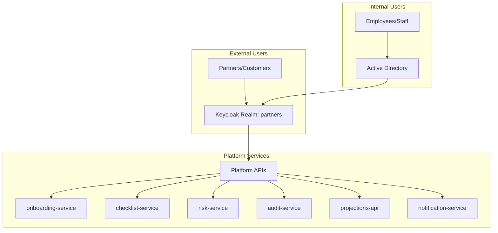

# Keycloak & Active Directory Integration Guide

## 🔐 Dual Authentication System

This platform supports **dual authentication** for different user types:
- **External Users** (Partners, Customers) → **Keycloak OAuth 2.1**
- **Internal Users** (Employees, Compliance Officers) → **Active Directory Federation via Keycloak**

## 🏗️ Architecture Overview



## 🔧 Keycloak Configuration

### 1. Realm Setup

#### Create Realms
```bash
# Access Keycloak Admin Console
https://keycloak.yourdomain.tld

# Create two realms:
# 1. "partners" - for external users
# 2. "internal" - for internal users (optional, can use partners with AD federation)
```

#### Partners Realm Configuration
```json
{
  "realm": "partners",
  "enabled": true,
  "displayName": "Partner Portal",
  "registrationAllowed": true,
  "registrationEmailAsUsername": true,
  "rememberMe": true,
  "verifyEmail": true,
  "loginWithEmailAllowed": true,
  "duplicateEmailsAllowed": false,
  "resetPasswordAllowed": true,
  "editUsernameAllowed": false,
  "bruteForceProtected": true,
  "permanentLockout": false,
  "maxFailureWaitSeconds": 900,
  "minimumQuickLoginWaitSeconds": 60,
  "waitIncrementSeconds": 60,
  "quickLoginCheckMilliSeconds": 1000,
  "maxDeltaTimeSeconds": 43200,
  "failureFactor": 30
}
```

### 2. Client Configuration

#### Partner Portal Client
```json
{
  "clientId": "partner-portal",
  "name": "Partner Portal Application",
  "description": "React frontend for partners",
  "enabled": true,
  "clientAuthenticatorType": "client-secret",
  "secret": "your-client-secret-here",
  "redirectUris": [
    "https://portal.yourdomain.tld/*",
    "http://localhost:3000/*"
  ],
  "webOrigins": [
    "https://portal.yourdomain.tld",
    "http://localhost:3000"
  ],
  "protocol": "openid-connect",
  "attributes": {
    "saml.assertion.signature": "false",
    "saml.force.post.binding": "false",
    "saml.multivalued.roles": "false",
    "saml.encrypt": "false",
    "oauth2.device.authorization.grant.enabled": "false",
    "backchannel.logout.revoke.offline.tokens": "false",
    "saml.server.signature": "false",
    "saml.server.signature.keyinfo.ext": "false",
    "exclude.session.state.from.auth.response": "false",
    "oidc.ciba.grant.enabled": "false",
    "saml.artifact.binding": "false",
    "backchannel.logout.session.required": "true",
    "client_credentials.use_refresh_token": "false",
    "saml_force_name_id_format": "false",
    "require.pushed.authorization.requests": "false",
    "saml.client.signature": "false",
    "tls.client.certificate.bound.access.tokens": "false",
    "saml.authnstatement": "false",
    "display.on.consent.screen": "false",
    "saml.onetimeuse.condition": "false"
  },
  "authenticationFlowBindingOverrides": {},
  "fullScopeAllowed": true,
  "nodeReRegistrationTimeout": -1,
  "defaultClientScopes": [
    "web-origins",
    "role_list",
    "profile",
    "roles",
    "email"
  ],
  "optionalClientScopes": [
    "address",
    "phone",
    "offline_access",
    "microprofile-jwt"
  ]
}
```

#### Service-to-Service Clients
```json
{
  "clientId": "onboarding-service",
  "name": "Onboarding Service",
  "enabled": true,
  "serviceAccountsEnabled": true,
  "standardFlowEnabled": false,
  "implicitFlowEnabled": false,
  "directAccessGrantsEnabled": false,
  "clientAuthenticatorType": "client-secret",
  "secret": "service-secret-here"
}
```

### 3. User Roles & Groups

#### Create Roles
```bash
# Realm Roles
- partner                    # External partner users
- compliance_officer         # Internal compliance staff
- admin                     # System administrators
- viewer                    # Read-only access
- case_manager              # Case management permissions
- risk_analyst              # Risk assessment permissions
- auditor                   # Audit log access
```

#### Create Groups
```bash
# External Groups
- Partners
  - Individual Partners
  - Corporate Partners
  - Premium Partners

# Internal Groups (via AD Federation)
- Employees
  - Compliance Team
  - Risk Team
  - Operations Team
  - IT Team
```

## 🏢 Active Directory Integration

### 1. LDAP Federation Setup

#### Add LDAP Provider
```json
{
  "providerId": "ldap",
  "providerType": "org.keycloak.storage.UserStorageProvider",
  "config": {
    "enabled": ["true"],
    "priority": ["0"],
    "fullSyncPeriod": ["604800"],
    "changedSyncPeriod": ["86400"],
    "cachePolicy": ["DEFAULT"],
    "batchSizeForSync": ["1000"],
    "editMode": ["READ_ONLY"],
    "syncRegistrations": ["false"],
    "vendor": ["ad"],
    "usernameLDAPAttribute": ["sAMAccountName"],
    "rdnLDAPAttribute": ["cn"],
    "uuidLDAPAttribute": ["objectGUID"],
    "userObjectClasses": ["person, organizationalPerson, user"],
    "connectionUrl": ["ldaps://your-domain-controller.company.com:636"],
    "usersDn": ["CN=Users,DC=company,DC=com"],
    "authType": ["simple"],
    "bindDn": ["CN=keycloak-service,CN=Users,DC=company,DC=com"],
    "bindCredential": ["service-account-password"],
    "searchScope": ["2"],
    "useTruststoreSpi": ["ldapsOnly"],
    "connectionPooling": ["true"],
    "pagination": ["true"],
    "allowKerberosAuthentication": ["false"],
    "serverPrincipal": [""],
    "keyTab": [""],
    "kerberosRealm": [""],
    "debug": ["false"],
    "useKerberosForPasswordAuthentication": ["false"]
  }
}
```

### 2. LDAP Mappers

#### User Attribute Mappers
```json
[
  {
    "name": "username",
    "providerId": "user-attribute-ldap-mapper",
    "config": {
      "ldap.attribute": ["sAMAccountName"],
      "user.model.attribute": ["username"],
      "read.only": ["true"],
      "always.read.value.from.ldap": ["false"],
      "is.mandatory.in.ldap": ["true"]
    }
  },
  {
    "name": "email",
    "providerId": "user-attribute-ldap-mapper",
    "config": {
      "ldap.attribute": ["mail"],
      "user.model.attribute": ["email"],
      "read.only": ["true"],
      "always.read.value.from.ldap": ["false"],
      "is.mandatory.in.ldap": ["false"]
    }
  },
  {
    "name": "first name",
    "providerId": "user-attribute-ldap-mapper",
    "config": {
      "ldap.attribute": ["givenName"],
      "user.model.attribute": ["firstName"],
      "read.only": ["true"],
      "always.read.value.from.ldap": ["false"],
      "is.mandatory.in.ldap": ["true"]
    }
  },
  {
    "name": "last name",
    "providerId": "user-attribute-ldap-mapper",
    "config": {
      "ldap.attribute": ["sn"],
      "user.model.attribute": ["lastName"],
      "read.only": ["true"],
      "always.read.value.from.ldap": ["false"],
      "is.mandatory.in.ldap": ["true"]
    }
  }
]
```

#### Group Mapper
```json
{
  "name": "group-ldap-mapper",
  "providerId": "group-ldap-mapper",
  "config": {
    "groups.dn": ["CN=Groups,DC=company,DC=com"],
    "group.name.ldap.attribute": ["cn"],
    "group.object.classes": ["group"],
    "preserve.group.inheritance": ["true"],
    "ignore.missing.groups": ["false"],
    "membership.ldap.attribute": ["member"],
    "membership.attribute.type": ["DN"],
    "membership.user.ldap.attribute": ["distinguishedName"],
    "groups.ldap.filter": [""],
    "mode": ["READ_ONLY"],
    "user.roles.retrieve.strategy": ["LOAD_GROUPS_BY_MEMBER_ATTRIBUTE"],
    "memberof.ldap.attribute": ["memberOf"],
    "drop.non.existing.groups.during.sync": ["false"]
  }
}
```

### 3. Role Mapping

#### Map AD Groups to Keycloak Roles
```json
{
  "name": "role-ldap-mapper",
  "providerId": "role-ldap-mapper",
  "config": {
    "roles.dn": ["CN=Roles,DC=company,DC=com"],
    "role.name.ldap.attribute": ["cn"],
    "role.object.classes": ["group"],
    "membership.ldap.attribute": ["member"],
    "membership.attribute.type": ["DN"],
    "membership.user.ldap.attribute": ["distinguishedName"],
    "roles.ldap.filter": [""],
    "mode": ["READ_ONLY"],
    "user.roles.retrieve.strategy": ["LOAD_ROLES_BY_MEMBER_ATTRIBUTE"],
    "memberof.ldap.attribute": ["memberOf"],
    "use.realm.roles.mapping": ["true"]
  }
}
```

## 🔐 Authentication Flows

### 1. External User Flow (Partners)

```typescript
// React Frontend Authentication
import Keycloak from 'keycloak-js';

const keycloak = new Keycloak({
  url: 'https://keycloak.yourdomain.tld',
  realm: 'partners',
  clientId: 'partner-portal'
});

// Initialize authentication
keycloak.init({
  onLoad: 'login-required',
  checkLoginIframe: false,
  pkceMethod: 'S256'
}).then((authenticated) => {
  if (authenticated) {
    // User is authenticated
    const token = keycloak.token;
    const userInfo = keycloak.tokenParsed;
    
    // Set up API client with token
    setupApiClient(token);
  }
});

// Token refresh
keycloak.onTokenExpired = () => {
  keycloak.updateToken(30).then((refreshed) => {
    if (refreshed) {
      setupApiClient(keycloak.token);
    } else {
      keycloak.login();
    }
  });
};
```

### 2. Internal User Flow (AD Federation)

```typescript
// Same frontend code, but users authenticate via AD
// Keycloak handles the AD federation transparently

// Login flow:
// 1. User clicks login
// 2. Redirected to Keycloak
// 3. Keycloak checks if user exists in LDAP
// 4. If yes, authenticates against AD
// 5. Creates/updates Keycloak user with AD attributes
// 6. Returns JWT token with roles from AD groups
```

## 🛡️ Service Configuration

### 1. Update Service appsettings.json

```json
{
  "Keycloak": {
    "Authority": "https://keycloak.yourdomain.tld/realms/partners",
    "Audience": "onboarding-service",
    "RequireHttpsMetadata": true,
    "ValidateIssuer": true,
    "ValidateAudience": true,
    "ValidateLifetime": true,
    "ClockSkew": "00:05:00"
  },
  "Authorization": {
    "Policies": {
      "PartnerAccess": {
        "RequiredRoles": ["partner"]
      },
      "ComplianceAccess": {
        "RequiredRoles": ["compliance_officer", "admin"]
      },
      "AdminAccess": {
        "RequiredRoles": ["admin"]
      },
      "InternalAccess": {
        "RequiredRoles": ["compliance_officer", "admin", "case_manager", "risk_analyst"]
      }
    }
  }
}
```

### 2. Authorization Policies in .NET

```csharp
// Program.cs
builder.Services.AddAuthorization(options =>
{
    options.AddPolicy("PartnerAccess", policy =>
        policy.RequireRole("partner"));
    
    options.AddPolicy("ComplianceAccess", policy =>
        policy.RequireRole("compliance_officer", "admin"));
    
    options.AddPolicy("AdminAccess", policy =>
        policy.RequireRole("admin"));
    
    options.AddPolicy("InternalAccess", policy =>
        policy.RequireRole("compliance_officer", "admin", "case_manager", "risk_analyst"));
    
    options.AddPolicy("AuditAccess", policy =>
        policy.RequireRole("auditor", "compliance_officer", "admin"));
});
```

### 3. Controller Authorization

```csharp
[ApiController]
[Route("api/v1/cases")]
[Authorize]
public class OnboardingCasesController : ControllerBase
{
    // Partners can create their own cases
    [HttpPost]
    [Authorize(Policy = "PartnerAccess")]
    public async Task<IActionResult> CreateCase([FromBody] CreateCaseRequest request)
    {
        // Implementation
    }
    
    // Internal users can view all cases
    [HttpGet]
    [Authorize(Policy = "InternalAccess")]
    public async Task<IActionResult> GetAllCases()
    {
        // Implementation
    }
    
    // Only compliance officers can approve cases
    [HttpPost("{caseId}/approve")]
    [Authorize(Policy = "ComplianceAccess")]
    public async Task<IActionResult> ApproveCase(string caseId)
    {
        // Implementation
    }
    
    // Only auditors can access audit logs
    [HttpGet("{caseId}/audit")]
    [Authorize(Policy = "AuditAccess")]
    public async Task<IActionResult> GetAuditTrail(string caseId)
    {
        // Implementation
    }
}
```

## 🔄 User Context & Claims

### 1. Extract User Information

```csharp
public class UserContextService
{
    private readonly IHttpContextAccessor _httpContextAccessor;
    
    public UserContextService(IHttpContextAccessor httpContextAccessor)
    {
        _httpContextAccessor = httpContextAccessor;
    }
    
    public string GetUserId()
    {
        return _httpContextAccessor.HttpContext?.User?.FindFirst("sub")?.Value ?? "anonymous";
    }
    
    public string GetUserEmail()
    {
        return _httpContextAccessor.HttpContext?.User?.FindFirst("email")?.Value ?? "";
    }
    
    public string GetUserRole()
    {
        return _httpContextAccessor.HttpContext?.User?.FindFirst("role")?.Value ?? "unknown";
    }
    
    public string GetPartnerId()
    {
        // For external users, get partner ID from claims
        return _httpContextAccessor.HttpContext?.User?.FindFirst("partner_id")?.Value ?? "";
    }
    
    public bool IsInternalUser()
    {
        var roles = _httpContextAccessor.HttpContext?.User?.FindAll("role")?.Select(c => c.Value);
        return roles?.Any(r => new[] { "compliance_officer", "admin", "case_manager", "risk_analyst", "auditor" }.Contains(r)) ?? false;
    }
    
    public bool IsExternalUser()
    {
        return _httpContextAccessor.HttpContext?.User?.HasClaim("role", "partner") ?? false;
    }
}
```

### 2. Data Filtering by User Type

```csharp
public class OnboardingCaseService
{
    private readonly UserContextService _userContext;
    
    public async Task<List<OnboardingCase>> GetCasesAsync()
    {
        if (_userContext.IsExternalUser())
        {
            // Partners only see their own cases
            var partnerId = _userContext.GetPartnerId();
            return await _repository.GetCasesByPartnerIdAsync(partnerId);
        }
        else if (_userContext.IsInternalUser())
        {
            // Internal users see all cases (with role-based filtering)
            return await _repository.GetAllCasesAsync();
        }
        
        throw new UnauthorizedAccessException("Invalid user type");
    }
}
```

## 🚀 Deployment Configuration

### 1. Keycloak Helm Values

```yaml
# infra/helm/values/dev.yaml
keycloak:
  auth:
    adminUser: admin
    adminPassword: "change-me-strong-password"
  
  postgresql:
    enabled: true
    auth:
      password: "keycloak-db-password"
  
  extraEnvVars:
    - name: KC_HOSTNAME
      value: "keycloak.yourdomain.tld"
    - name: KC_HOSTNAME_STRICT
      value: "false"
    - name: KC_HTTP_ENABLED
      value: "true"
    - name: KC_PROXY
      value: "edge"
  
  ingress:
    enabled: true
    hostname: keycloak.yourdomain.tld
    annotations:
      cert-manager.io/cluster-issuer: "letsencrypt-prod"
    tls: true
```

### 2. Service Environment Variables

```yaml
# All services need these Keycloak settings
env:
  - name: Keycloak__Authority
    value: "https://keycloak.yourdomain.tld/realms/partners"
  - name: Keycloak__Audience
    value: "onboarding-service"  # Change per service
  - name: Keycloak__RequireHttpsMetadata
    value: "true"
```

## 🧪 Testing Authentication

### 1. Get Token for External User

```bash
# Get token for partner user
TOKEN=$(curl -s -X POST "https://keycloak.yourdomain.tld/realms/partners/protocol/openid-connect/token" \
  -H "Content-Type: application/x-www-form-urlencoded" \
  -d "grant_type=password" \
  -d "client_id=partner-portal" \
  -d "client_secret=your-client-secret" \
  -d "username=partner@example.com" \
  -d "password=partner-password" \
  | jq -r '.access_token')

# Test API with partner token
curl -H "Authorization: Bearer $TOKEN" \
  https://api.yourdomain.tld/onboarding/v1/cases
```

### 2. Get Token for Internal User

```bash
# Get token for internal user (same endpoint, AD user)
TOKEN=$(curl -s -X POST "https://keycloak.yourdomain.tld/realms/partners/protocol/openid-connect/token" \
  -H "Content-Type: application/x-www-form-urlencoded" \
  -d "grant_type=password" \
  -d "client_id=partner-portal" \
  -d "client_secret=your-client-secret" \
  -d "username=john.doe@company.com" \
  -d "password=ad-password" \
  | jq -r '.access_token')

# Test API with internal user token
curl -H "Authorization: Bearer $TOKEN" \
  https://api.yourdomain.tld/onboarding/v1/cases/all
```

## 📋 Setup Checklist

### ✅ Keycloak Configuration
- [ ] Create "partners" realm
- [ ] Configure partner-portal client
- [ ] Create service clients for each microservice
- [ ] Set up realm roles (partner, compliance_officer, admin, etc.)
- [ ] Configure client scopes and mappers

### ✅ Active Directory Integration
- [ ] Create service account in AD for Keycloak
- [ ] Configure LDAP user federation
- [ ] Set up user attribute mappers
- [ ] Configure group/role mappers
- [ ] Test AD authentication

### ✅ Service Configuration
- [ ] Update all service appsettings.json files
- [ ] Configure authorization policies
- [ ] Add role-based authorization to controllers
- [ ] Implement user context service
- [ ] Test service-to-service authentication

### ✅ Frontend Integration
- [ ] Configure Keycloak JS client
- [ ] Implement login/logout flows
- [ ] Set up token refresh
- [ ] Handle role-based UI rendering
- [ ] Test both external and internal user flows

This dual authentication system provides secure access for both external partners and internal employees while maintaining proper separation of concerns and role-based access control.
